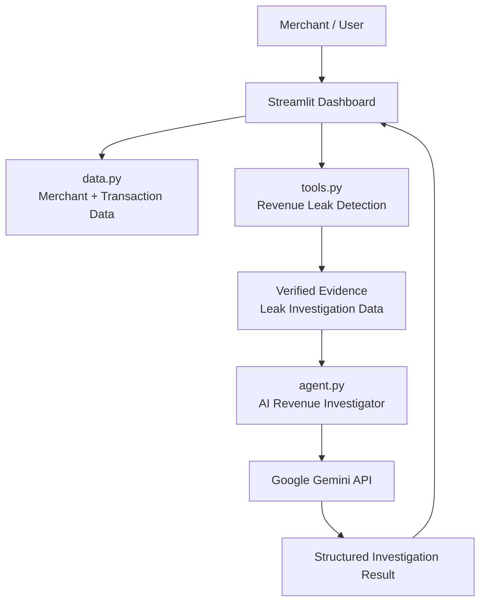
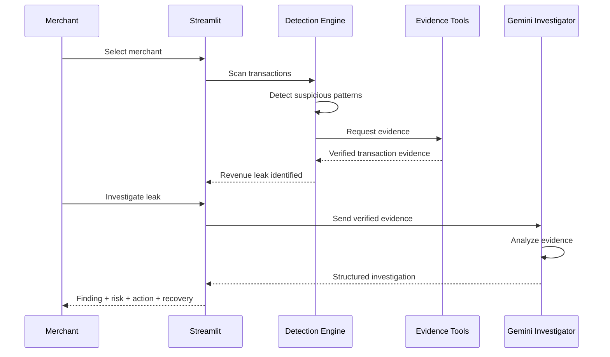
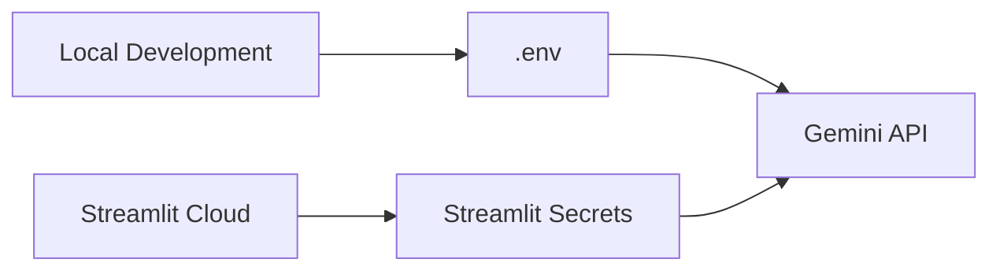
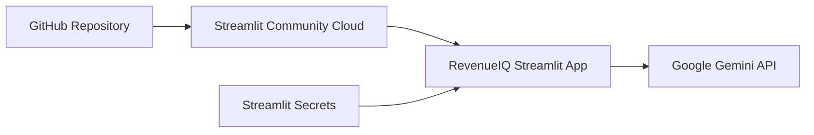
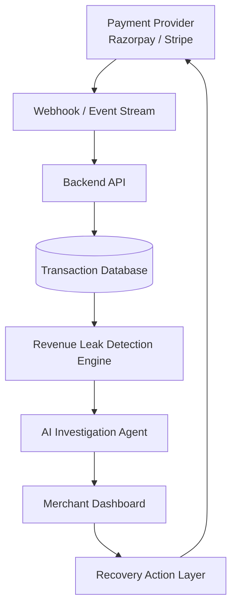

# 💎 RevenueIQ

### AI-Powered Revenue Leak Detection & Recovery Intelligence

> **RevenueIQ finds the money a business is losing, explains why it's happening, and tells the merchant what to do next.**

** Live Demo:** https://revenueiq-cfl25bhdep3p9smnfzkohw.streamlit.app/

**Repository:** https://github.com/PallaviNawander/RevenueIQ

---

##  What is RevenueIQ?

Businesses don't only lose money because of low sales.

They lose money because revenue gets **stuck, abandoned, failed, duplicated, or never recovered**.

A payment can fail.

A customer can abandon a payment after initiating it.

A transaction can enter an unusual state.

A recoverable payment can remain unnoticed.

The problem is that these events are usually buried inside thousands of transaction records.

**RevenueIQ turns those transaction-level signals into actionable revenue intelligence.**

Instead of simply showing:

> "Payment failed."

RevenueIQ answers:

> **"This merchant has a high-value recoverable revenue leak. Here's the evidence, here's the financial risk, and here's the most appropriate recovery action."**

---

#  The Core Idea

RevenueIQ follows a simple principle:

```text
DETECT → VERIFY → INVESTIGATE → PRIORITIZE → RECOVER
```

### Traditional analytics

```text
Transaction Data
      ↓
Dashboards
      ↓
Merchant manually investigates
```

### RevenueIQ

```text
Transaction Data
      ↓
Deterministic Leak Detection
      ↓
Verified Evidence
      ↓
AI Investigation
      ↓
Risk + Confidence + Recovery Estimate
      ↓
Actionable Recommendation
```

The AI is **not responsible for discovering facts from scratch**.

The deterministic analysis layer identifies the suspected leak first.

The AI receives the verified evidence and explains what it means.

This makes RevenueIQ **evidence-grounded rather than hallucination-driven.**

---

# Key Features

## 1.  Merchant Revenue Dashboard

RevenueIQ provides a merchant-centric view of revenue health.

The dashboard surfaces:

* Revenue performance
* Suspected revenue leaks
* Financial exposure
* Priority issues
* Merchant-specific transaction insights
* Recovery opportunities

---

## 2.  Revenue Leak Detection

The detection engine analyzes transaction-level data to identify suspicious revenue events.

Examples include:

* Abandoned payment attempts
* Failed payment scenarios
* Potentially recoverable transactions
* High-value payment issues
* Other suspicious transaction patterns

The detection layer is intentionally deterministic.

It does not ask an LLM to randomly "find" a problem.

Instead:

```text
Transaction
    ↓
Rule / Pattern Detection
    ↓
Potential Leak
    ↓
Evidence Bundle
```

---

## 3.  Merchant-Aware Analysis

RevenueIQ is designed around **merchants/businesses**, not isolated transactions.

A merchant may have:

```text
Merchant
   │
   ├── Customers
   │
   ├── Transactions
   │
   ├── Successful Payments
   │
   ├── Failed Payments
   │
   └── Revenue Leaks
```

This allows the system to answer questions such as:

* Which merchant has the largest exposure?
* Which leaks deserve attention first?
* Which transactions are potentially recoverable?
* What action should the merchant take?

---

#  AI Revenue Investigator

The heart of RevenueIQ is its AI investigation layer.

Once the detection engine identifies a leak, the investigator receives a **verified evidence package**.

The AI then determines:

1. What happened?
2. Why is it likely a revenue leak?
3. What evidence supports the conclusion?
4. How confident is the investigation?
5. What is the financial risk?
6. What action should the merchant take?
7. How much revenue could potentially be recovered?

The investigator returns a structured result containing:

```json
{
  "summary": "...",
  "finding": "...",
  "evidence": [],
  "confidence": 0,
  "risk": "LOW",
  "recommended_action": "RETRY_PAYMENT",
  "recovery_amount": 0,
  "reason": "..."
}
```

---

#  Evidence-Grounded AI

One of the most important design decisions in RevenueIQ is separating **detection** from **reasoning**.

The AI is explicitly instructed:

* Do not invent transaction IDs.
* Do not invent customers.
* Do not invent amounts.
* Do not invent dates.
* Do not claim unsupported events.
* Do not recommend unsupported refunds.
* Do not recover more money than the transaction amount.

Therefore:

```text
                 ┌─────────────────────┐
                 │  Transaction Data   │
                 └──────────┬──────────┘
                            ↓
                 ┌─────────────────────┐
                 │ Deterministic       │
                 │ Detection Engine     │
                 └──────────┬──────────┘
                            ↓
                 ┌─────────────────────┐
                 │ Verified Evidence   │
                 └──────────┬──────────┘
                            ↓
                 ┌─────────────────────┐
                 │ Gemini AI           │
                 │ Investigator        │
                 └──────────┬──────────┘
                            ↓
                 ┌─────────────────────┐
                 │ Structured Decision │
                 └─────────────────────┘
```

This architecture reduces the risk of an LLM inventing financial information.

---

#  System Architecture



### Architecture flow

The system is intentionally lightweight:

**Streamlit UI**

→ presents merchant information and revenue insights.

**Data Layer**

→ provides the merchant and transaction dataset used by the demo.

**Detection Layer**

→ identifies suspicious revenue events using deterministic logic.

**Evidence Layer**

→ collects the transaction-level facts associated with a detected leak.

**AI Investigation Layer**

→ sends only the verified evidence to Gemini.

**Decision Layer**

→ receives a structured investigation containing confidence, risk, recommended action, and recovery amount.

**Dashboard**

→ presents the result to the merchant.

---

#  Detailed Investigation Pipeline



---

#  Project Architecture

The project deliberately avoids unnecessary infrastructure for the prototype.

```text
RevenueIQ/
│
├── app.py
│   └── Streamlit application
│
├── agent.py
│   └── Gemini-powered investigation agent
│
├── tools.py
│   └── Revenue leak detection + evidence retrieval
│
├── data.py
│   └── Merchant and transaction dataset
│
├── test_gemini.py
│   └── Gemini connectivity / API testing
│
├── requirements.txt
│   └── Python dependencies
│
├── .gitignore
│   └── Secrets and local environment exclusions
│
└── .env
    └── Local API credentials
    └── NOT committed to GitHub
```

---

#  Component Breakdown

## `app.py`

The main application layer.

Responsibilities include:

* Rendering the RevenueIQ interface
* Displaying merchant information
* Presenting revenue metrics
* Showing detected leaks
* Triggering investigations
* Displaying AI-generated investigation results
* Managing Streamlit UI state

Conceptually:

```text
User
 ↓
app.py
 ↓
Detection / Investigation
 ↓
UI Result
```

---

## `data.py`

Contains the project's structured demo data.

It represents the business environment RevenueIQ analyzes, including merchant and transaction information.

The prototype intentionally keeps this data local rather than introducing a database.

This makes the system:

* Easy to run
* Easy to demonstrate
* Easy to modify
* Fast to deploy
* Simple to understand

For a production implementation, this layer can later be replaced with a payment provider or transactional database.

---

## `tools.py`

This is the **deterministic intelligence layer**.

It performs the actual revenue-leak analysis and retrieves evidence associated with detected leaks.

The important separation is:

```text
tools.py
=
"What happened according to the data?"
```

while:

```text
agent.py
=
"What does this evidence mean and what should the merchant do?"
```

This separation prevents the AI from becoming the source of truth for transaction data.

---

#  `agent.py`

The AI investigation layer uses Google's Gemini API.

Its responsibility is not to blindly inspect the entire dataset.

Instead, it receives a verified evidence bundle from the detection system.

```text
tools.py
     │
     │ verified evidence
     ↓
agent.py
     │
     │ structured prompt
     ↓
Gemini
     │
     ↓
JSON investigation
```

The AI returns:

* Summary
* Finding
* Evidence
* Confidence
* Risk
* Recommended action
* Recovery amount
* Reason

---

#  Recovery Decision Model

RevenueIQ currently supports several possible actions:

| Action             | Meaning                                       |
| ------------------ | --------------------------------------------- |
| `RETRY_PAYMENT`    | Attempt to recover a failed/abandoned payment |
| `CONTACT_CUSTOMER` | Follow up with the customer                   |
| `REFUND`           | Refund when the evidence supports it          |
| `ESCALATE`         | Requires human/business review                |
| `IGNORE`           | No meaningful recovery action required        |

The AI is explicitly constrained to choose actions based on evidence.

---

# 🎯 Priority-Based Revenue Recovery

Not every revenue leak deserves equal attention.

RevenueIQ therefore considers the financial significance of detected issues.

A useful conceptual prioritization model is:

```text
Priority
   =
Financial Exposure
×
Recoverability
×
Confidence
```

This means a small, low-confidence issue does not necessarily outrank a high-value transaction with strong evidence.

The ultimate goal is not simply:

> "Find more anomalies."

It is:

> **"Find the revenue leaks that are most worth recovering."**

---

#  Security

RevenueIQ keeps API credentials outside the source code.

### Local development

Credentials are stored in:

```text
.env
```

Example:

```text
GEMINI_API_KEY=your_api_key
```

### Streamlit deployment

Secrets are stored using Streamlit's secret-management system.

The `.env` file is excluded using `.gitignore`:

```text
.env
venv/
__pycache__/
*.pyc
.streamlit/secrets.toml
```

### API key flow



**API keys should never be committed to GitHub.**

---

#  Deployment Architecture

RevenueIQ is designed to run as a lightweight Streamlit application.



Deployment flow:

```text
GitHub
   ↓
Streamlit Cloud
   ↓
app.py
   ↓
RevenueIQ
   ↓
Gemini API
```

---

#  Live Demo

## RevenueIQ is deployed here:

> 🔗 **[Open RevenueIQ Live Demo](!-- ADD YOUR STREAMLIT URL HERE --)**

<!--
Replace the placeholder above with your actual Streamlit deployment URL.

Example:
https://revenueiq.streamlit.app
-->

---

# 🛠️ Tech Stack

| Technology                    | Purpose                               |
| ----------------------------- | ------------------------------------- |
| **Python**                    | Core application logic                |
| **Streamlit**                 | Interactive web application           |
| **Google Gemini**             | AI investigation and reasoning        |
| **python-dotenv**             | Local environment configuration       |
| **Git + GitHub**              | Version control and source management |
| **Streamlit Community Cloud** | Deployment                            |

---

# ⚡ Getting Started

## 1. Clone the repository

```bash
git clone https://github.com/PallaviNawander/RevenueIQ.git
cd RevenueIQ
```

---

## 2. Create a virtual environment

```bash
python3 -m venv venv
```

Activate it:

### Linux / macOS

```bash
source venv/bin/activate
```

### Windows

```bash
venv\Scripts\activate
```

---

## 3. Install dependencies

```bash
pip install -r requirements.txt
```

---

## 4. Configure your API key

Create a `.env` file:

```text
GEMINI_API_KEY=your_api_key_here
```

Never commit this file.

---

## 5. Run RevenueIQ

```bash
streamlit run app.py
```

The application will open in your browser.

---

#  Testing Gemini

The repository also contains:

```text
test_gemini.py
```

which can be used to verify Gemini API connectivity independently from the main application.

---

# 📈 Current Architecture vs Production Architecture

RevenueIQ is intentionally designed as a **buildathon-ready prototype architecture**.

The current implementation:

```text
Streamlit
    ↓
Local Transaction Data
    ↓
Detection Tools
    ↓
Gemini Investigator
```

A production implementation could evolve into:



This creates a natural path from prototype → production without changing RevenueIQ's core idea.

---

# Future Roadmap

### Phase 1 — Prototype 

* [x] Merchant dashboard
* [x] Transaction-level revenue leak detection
* [x] Evidence retrieval
* [x] AI investigation
* [x] Confidence scoring
* [x] Risk classification
* [x] Recovery recommendations
* [x] Recovery amount estimation
* [x] Streamlit deployment

### Phase 2 — Payment Infrastructure

* [ ] Razorpay API integration
* [ ] Payment webhooks
* [ ] Live transaction ingestion
* [ ] Automated leak detection
* [ ] Historical transaction analysis

### Phase 3 — Revenue Recovery

* [ ] Automated payment retry
* [ ] Customer recovery workflows
* [ ] Merchant alerts
* [ ] Recovery tracking
* [ ] Recovery success analytics

### Phase 4 — Intelligent Revenue Operations

* [ ] Merchant-specific detection rules
* [ ] Anomaly detection
* [ ] Revenue-loss forecasting
* [ ] Recovery probability scoring
* [ ] Automated prioritization
* [ ] Continuous monitoring

---

# Design Philosophy

RevenueIQ is built around three principles.

### 1. Evidence before AI

The AI should reason over facts, not manufacture them.

```text
DATA
 ↓
EVIDENCE
 ↓
AI
```

not:

```text
DATA
 ↓
AI guesses
```

---

### 2. Action over analytics

RevenueIQ isn't designed to be another dashboard full of charts.

The objective is:

```text
Revenue Problem
      ↓
Understand It
      ↓
Prioritize It
      ↓
Act On It
      ↓
Recover Revenue
```

---

### 3. Simple infrastructure, strong intelligence

The prototype deliberately avoids unnecessary infrastructure.

No database is required for the current demonstration.

No microservices are required.

No complicated backend deployment is required.

The intelligence comes from the combination of:

```text
Deterministic Detection
        +
Verified Evidence
        +
Generative AI
        =
Revenue Recovery Intelligence
```

---

#  Why RevenueIQ?

Most payment analytics systems answer:

> **"What happened to my payments?"**

RevenueIQ aims to answer the more valuable question:

> **"Where am I losing money, why am I losing it, and what should I recover first?"**

That shift — from **payment reporting** to **revenue recovery intelligence** — is the core of RevenueIQ.

---

#  Built For

RevenueIQ was built as a lightweight demonstration of how payment data, deterministic analytics, and generative AI can work together to create an actionable merchant intelligence system.

---

##  License

This project is intended as a prototype / buildathon project.

Add a license here if you decide to open-source the project formally.

---

<p align="center">

###  RevenueIQ

**Detect the leak. Understand the cause. Recover the revenue.**

</p>
```


